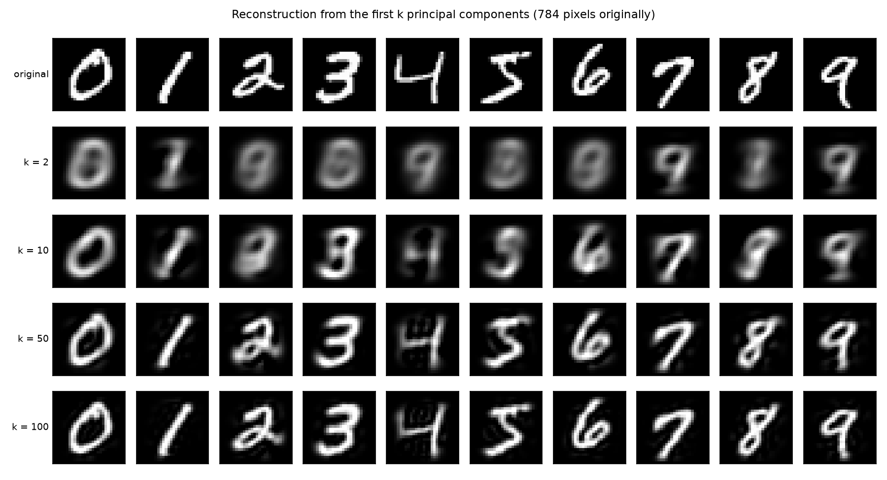
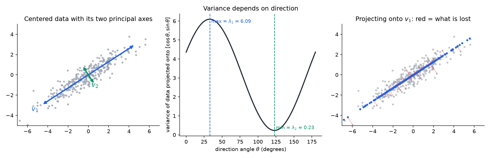
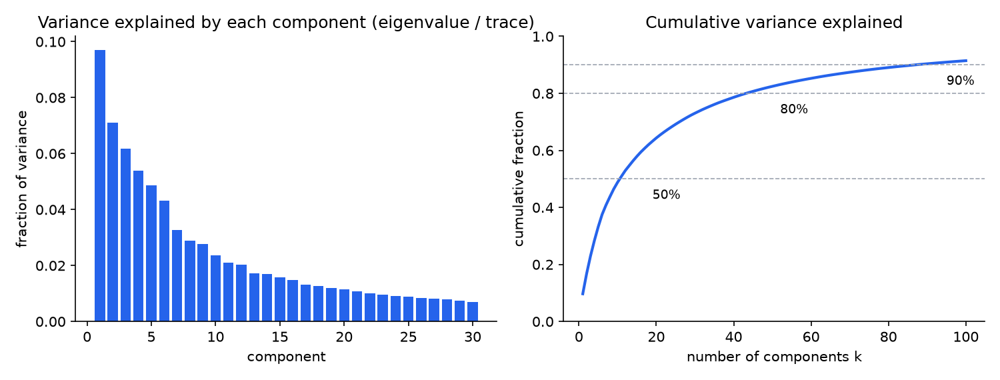
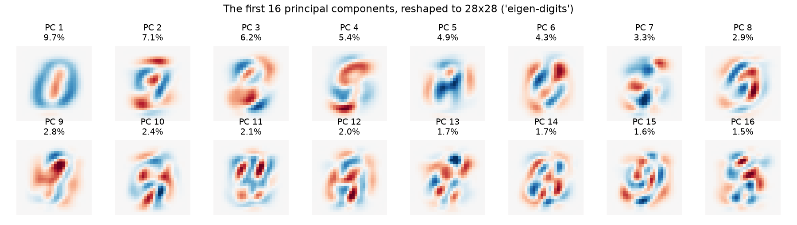
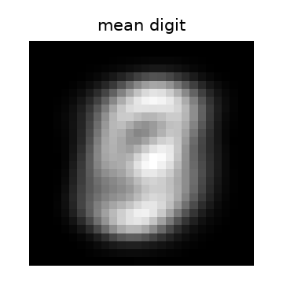
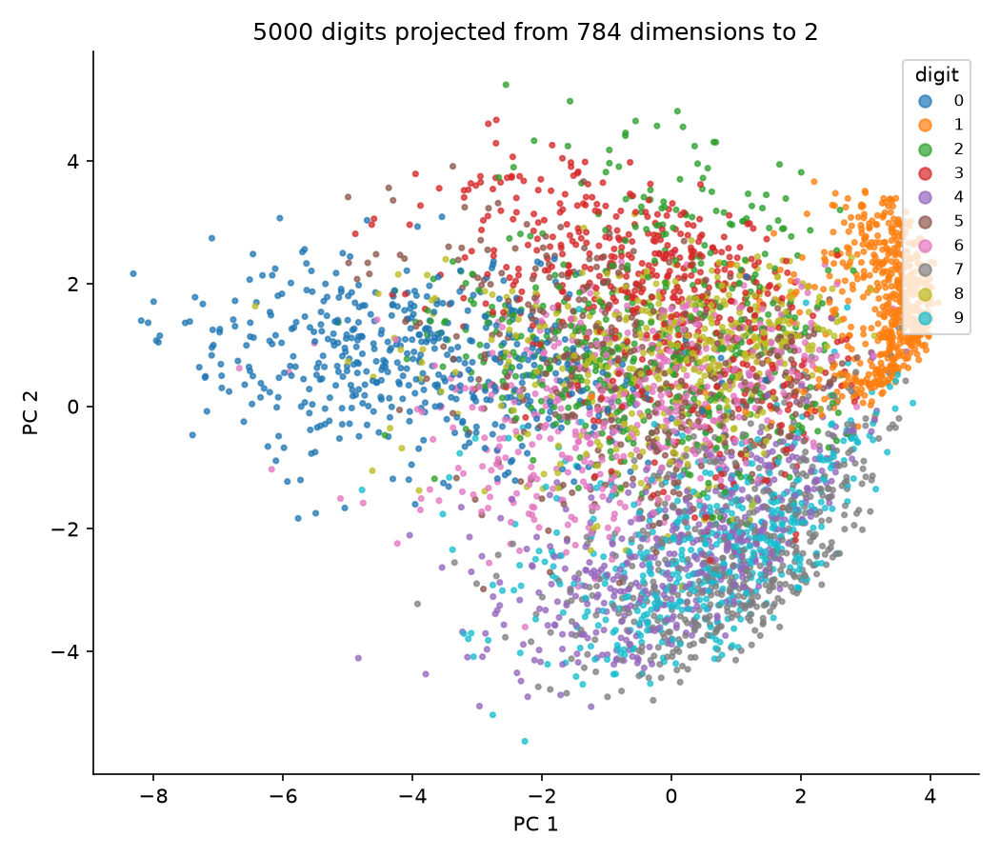

# Principal Component Analysis From Scratch

**Question.** Where does PCA come from? Can I derive it from a single optimisation problem, compute it with an eigensolver I write myself, and verify the result against a professional linear algebra library?

**Answer.** Yes. PCA falls out of "find the direction of maximum variance" via one Lagrange multiplier. A 60-line power-iteration solver recovers the eigenvectors of the $784 \times 784$ MNIST covariance matrix, matching LAPACK to $10^{-8}$. The first 100 of 784 directions carry 91.5% of the variance.



---

## Contents

1. [The idea in one paragraph](#1-the-idea-in-one-paragraph)
2. [A worked example you can do by hand](#2-a-worked-example-you-can-do-by-hand)
3. [The derivations](#3-the-derivations)
4. [The eigensolver: power iteration](#4-the-eigensolver-power-iteration)
5. [Verification](#5-verification)
6. [Results on MNIST](#6-results-on-mnist)
7. [Numerical lessons learned](#7-numerical-lessons-learned)
8. [How to run](#8-how-to-run)
9. [Code map](#9-code-map)

---

## 1. The idea in one paragraph

A data point with 784 numbers lives in a 784-dimensional space, but the points rarely fill it. Handwritten digits occupy a thin, curved sheet inside that space. PCA finds the flat subspace that best approximates the sheet: the direction along which the data varies most, then the direction varying most among those perpendicular to the first, and so on. Each direction is an eigenvector of the covariance matrix. Its eigenvalue is the variance along it. Keep the top $k$ directions and you have compressed 784 numbers to $k$ while losing as little as mathematically possible.



*Left: 2-D data with its two principal axes. Middle: variance of the data projected onto a unit vector, as that vector rotates. The maximum and minimum are the two eigenvalues. Right: projecting onto $v_1$ alone. The red segments are what is lost, and their mean squared length is $\lambda_2$.*

---

## 2. A worked example you can do by hand

Five points in two dimensions. Every number below is produced by the same code that handles MNIST. Run `python worked_example.py` to see it print.

### Data and centering

$$
X = \begin{bmatrix} 2 & 1 \\ 3 & 3 \\ 4 & 3 \\ 5 & 5 \\ 6 & 5 \end{bmatrix},
\qquad
\bar{x} = \begin{bmatrix} 4 & 3.4 \end{bmatrix},
\qquad
X_c = X - \mathbf{1}\bar{x} = \begin{bmatrix} -2 & -2.4 \\ -1 & -0.4 \\ 0 & -0.4 \\ 1 & 1.6 \\ 2 & 1.6 \end{bmatrix}
$$

### Covariance matrix

$$
C = \frac{1}{n - 1} X_c^{\mathsf T} X_c
  = \frac{1}{4} \begin{bmatrix} 10 & 10 \\ 10 & 11.2 \end{bmatrix}
  = \begin{bmatrix} 2.5 & 2.5 \\ 2.5 & 2.8 \end{bmatrix},
\qquad
\operatorname{tr}(C) = 5.3 \quad \text{(total variance)}
$$

### Eigenvalues from the characteristic polynomial

$$
\det(C - \lambda I) = (2.5 - \lambda)(2.8 - \lambda) - 2.5^2
  = \lambda^2 - 5.3\lambda + 0.75 = 0
$$

$$
\lambda_{1,2} = \frac{5.3 \pm \sqrt{5.3^2 - 4(0.75)}}{2}
  \quad\Longrightarrow\quad
\lambda_1 = 5.1545, \qquad \lambda_2 = 0.1455
$$

Check: $\lambda_1 + \lambda_2 = 5.3 = \operatorname{tr}(C)$. The trace of a matrix always equals the sum of its eigenvalues.

### First eigenvector

Solve $(C - \lambda_1 I) v = 0$. The first row gives $(2.5 - 5.1545) v_x + 2.5 v_y = 0$, so $v \propto \begin{bmatrix} 2.5 & 2.6545 \end{bmatrix}$. Normalised:

$$
v_1 = \begin{bmatrix} 0.6856 \\ 0.7280 \end{bmatrix}
$$

Power iteration (section 4) reaches the same vector in 10 iterations, agreeing with the hand solution to $|v_{\text{hand}} \cdot v_{\text{power}}| = 1.000000$.

### Project and reconstruct

$$
\text{scores} = X_c v_1 = \begin{bmatrix} -3.118 & -0.977 & -0.291 & 1.850 & 2.536 \end{bmatrix}^{\mathsf T}
$$

$$
\operatorname{Var}(\text{scores}) = 5.1545 = \lambda_1
$$

The eigenvalue *is* the variance of the data along its eigenvector. Mapping back with $\hat{X} = \text{scores}\, v_1^{\mathsf T} + \mathbf{1}\bar{x}$ and measuring the error:

$$
\frac{1}{n} \sum_i \lVert x_i - \hat{x}_i \rVert^2 = 0.1164 = \frac{n - 1}{n}\,\lambda_2
$$

What you drop is exactly what you lose. Keeping one of two dimensions retains $\lambda_1 / (\lambda_1 + \lambda_2) = 97.3\%$ of the variance.

---

## 3. The derivations

### 3.1 Variance along a direction

Let $X_c \in \mathbb{R}^{n \times d}$ be centered data and $u \in \mathbb{R}^d$ a unit vector. The projection of every point onto $u$ is the vector $X_c u \in \mathbb{R}^n$. Its variance is

$$
\operatorname{Var}(X_c u)
  = \frac{1}{n - 1} (X_c u)^{\mathsf T} (X_c u)
  = u^{\mathsf T} \left( \frac{1}{n - 1} X_c^{\mathsf T} X_c \right) u
  = u^{\mathsf T} C u .
$$

So the covariance matrix is the object that turns a direction into a variance. $C$ is symmetric ($C^{\mathsf T} = C$) and positive semi-definite ($u^{\mathsf T} C u \ge 0$ for all $u$, since it is a variance).

### 3.2 Maximising variance gives an eigenproblem

We want

$$
\max_{u} \; u^{\mathsf T} C u \quad \text{subject to} \quad u^{\mathsf T} u = 1 .
$$

Without the constraint the maximum is infinite (scale $u$ up). Introduce a Lagrange multiplier $\lambda$:

$$
\mathcal{L}(u, \lambda) = u^{\mathsf T} C u - \lambda \left( u^{\mathsf T} u - 1 \right).
$$

Set the gradient with respect to $u$ to zero, using $\nabla_u (u^{\mathsf T} C u) = 2 C u$ for symmetric $C$ and $\nabla_u (u^{\mathsf T} u) = 2u$:

$$
2 C u - 2 \lambda u = 0
\quad\Longleftrightarrow\quad
\boxed{C u = \lambda u} .
$$

**Every critical point is an eigenvector of $C$.** Plugging back in, the variance at such a point is $u^{\mathsf T} C u = u^{\mathsf T} (\lambda u) = \lambda$. So the eigenvalue is the variance, and the maximum variance is the largest eigenvalue $\lambda_1$, attained at its eigenvector $v_1$.

### 3.3 The remaining components

For the second direction, add the constraint $u^{\mathsf T} v_1 = 0$. The same Lagrangian argument with a second multiplier gives $C u = \lambda u$ again, so $u$ is an eigenvector orthogonal to $v_1$: the second-largest eigenvalue's eigenvector $v_2$. Repeating gives $v_3, \dots, v_d$.

This works because of the **spectral theorem**: a real symmetric matrix has $d$ real eigenvalues and an orthonormal basis of eigenvectors,

$$
C = V \Lambda V^{\mathsf T} = \sum_{i=1}^{d} \lambda_i \, v_i v_i^{\mathsf T},
\qquad V^{\mathsf T} V = I,
\qquad \lambda_1 \ge \lambda_2 \ge \dots \ge \lambda_d \ge 0 .
$$

### 3.4 Total variance and the fraction explained

The total variance is the sum of the per-feature variances, the diagonal of $C$:

$$
\operatorname{tr}(C) = \sum_{j=1}^{d} C_{jj} = \sum_{i=1}^{d} \lambda_i ,
$$

using the fact that trace is invariant under the similarity transform $C = V \Lambda V^{\mathsf T}$. Keep the first $k$ eigenvectors, and you capture

$$
\frac{\sum_{i=1}^{k} \lambda_i}{\sum_{i=1}^{d} \lambda_i} = \frac{\sum_{i=1}^{k} \lambda_i}{\operatorname{tr}(C)} \quad \text{of the variance.}
$$

### 3.5 Reconstruction error

Project each point $x_i$ onto the first $k$ directions: $\hat{x}_i = V_k V_k^{\mathsf T} x_i + \bar{x}$, where $V_k$ is the first $k$ columns of $V$. The reconstruction error per point is

$$
\frac{1}{n} \sum_i \lVert x_i - \hat{x}_i \rVert^2 = \sum_{i=k+1}^{d} \frac{n-1}{n} \lambda_i
$$

exactly the variance in the directions thrown away.

---

## 4. The eigensolver: power iteration

### 4.1 The algorithm

The dominant eigenpair is found by repeatedly multiplying by $C$:

$$
w^{(0)} = \text{random unit vector}
$$

$$
w^{(t+1)} = \frac{C w^{(t)}}{\lVert C w^{(t)} \rVert}
$$

The numerator projects onto the dominant eigenvector, and the denominator keeps the norm at 1. This converges exponentially: by iteration $t$ the error is $O(\rho^t)$ where $\rho = \lambda_2 / \lambda_1$ is the ratio of the two largest eigenvalues. For slow convergence you need ratio close to 1: for ratio $0.99$ (90 iterations needed) $\lambda_2 / \lambda_1 = 0.99$, for ratio $0.998$ it is about 14,000.

### 4.2 Estimating the eigenvalue: the Rayleigh quotient

For a unit vector $v$, the number $v^{\mathsf T} C v$ is the variance along $v$ (section 3.1). When $v$ is an eigenvector it equals $\lambda$ exactly. So the running eigenvalue estimate is $\lambda^{(t)} = v^{(t)\mathsf T} C v^{(t)}$.

### 4.3 Stopping rule

$v$ is an eigenvector exactly when $C v - \lambda v = 0$. So iterate until the residual is small relative to the eigenvalue:

$$
\lVert C v - \lambda v \rVert \le 10^{-12} \, \lambda .
$$

### 4.4 Finding the next eigenvector: deflation

Once $\lambda_1, v_1$ are known, form

$$
C' = C - \lambda_1 v_1 v_1^{\mathsf T} = \sum_{i=2}^{d} \lambda_i v_i v_i^{\mathsf T}.
$$

$C'$ has the same eigenvectors as $C$, but $v_1$ now has eigenvalue 0. Its dominant eigenpair is $\lambda_2, v_2$, so power iteration on $C'$ finds it. Repeat $k$ times.

In exact arithmetic that is the whole algorithm. In floating point it is not enough. Each multiplication reintroduces a tiny component along $v_1$ (rounding error), and for slowly converging eigenpairs those components accumulate over thousands of iterations until the "new" eigenvector is visibly not orthogonal to the old ones. The fix is to project out all previously found eigenvectors on every step, one Gram-Schmidt sweep:

$$
w \leftarrow w - Q Q^{\mathsf T} w, \qquad Q = \begin{bmatrix} v_1 & \cdots & v_{m} \end{bmatrix}.
$$

With this, orthonormality holds to $10^{-8}$ even for eigenvectors that never fully converged. Section 7 describes how this was discovered.

---

## 5. Verification

Nine tests in `tests/test_pca.py`, each encoding one mathematical fact from section 3. A wrong eigensolver can still produce plausible-looking pictures, so the pictures prove nothing. These do.

| Test | Mathematical fact | Tolerance |
|------|-------------------|-----------|
| eigenvalues match LAPACK | power iteration finds the same $\lambda_i$ as `eigvalsh` | rel $10^{-8}$ |
| eigenvectors match LAPACK | same $v_i$ as `eigh`, up to sign | abs $10^{-6}$ |
| descending, non-negative | $\lambda_1 \ge \lambda_2 \ge \dots \ge 0$ (PSD) | exact |
| components orthonormal | $V^{\mathsf T} V = I$ (spectral theorem) | abs $10^{-8}$ |
| matches SVD | $V = W$, $\lambda_i = \sigma_i^2 / (n-1)$ | rel $10^{-8}$ |
| scores uncorrelated | $\operatorname{Cov}(X_c V) = \Lambda$, diagonal | abs $10^{-8}$ |
| full-rank reconstruction exact | $V V^{\mathsf T} = I$ when $k = d$ | abs $10^{-8}$ |
| error equals dropped eigenvalues | section 3.5 formula, for $k = 1, 3, 7$ | rel $10^{-8}$ |
| eigenvalues sum to trace | $\sum \lambda_i = \operatorname{tr}(C)$ | rel $10^{-10}$ |

Eigenvectors are compared up to sign because $v$ and $-v$ are both valid eigenvectors; which one an algorithm returns is an accident of the starting vector.

```
python -m pytest tests -v
9 passed
```

---

## 6. Results on MNIST

60,000 training images, $d = 784$, $k = 100$ components by power iteration with deflation. Fit time about 66 seconds.



| Components $k$ | Cumulative variance | Reconstruction MSE per image |
|---:|---:|---:|
| 1 | 9.7 % | 47.6 |
| 2 | 16.8 % | 43.9 |
| 10 | 48.8 % | 27.0 |
| 11 | 50.0 % | |
| 44 | 80.0 % | |
| 50 | 82.5 % | 9.2 |
| 87 | 90.0 % | |
| 100 | 91.5 % | 4.5 |

Total variance $\operatorname{tr}(C) = 52.7$. The top eigenvalues are $5.12, \; 3.74, \; 3.25, \; 2.84, \; 2.57, \; 2.27$. The covariance matrix has rank 712, not 784: 72 border pixels are zero in every image, so those directions have exactly zero variance.

### What the components look like



Each principal component is a vector in $\mathbb{R}^{784}$, so it can be drawn as a $28 \times 28$ image. Red and blue are positive and negative weights. The first component is roughly "how much ink is in a ring shape", separating 0s from 1s. Later components capture slant, width, and the presence of loops. By component 16 they are hard to name, which matches their small share of the variance.



The mean image $\bar{x}$ that is subtracted before everything else.

### Compression

The figure at the top of this page shows one example of each digit reconstructed from $k = 2, 10, 50, 100$ components. At $k = 2$ everything looks like a blurry 0 or 9. At $k = 10$ digits are recognisable. At $k = 50$ they are clean. Storing 50 numbers instead of 784 is a 15.7× compression with 82.5 % of the variance retained.

### A 2-D map of the digits



Projecting onto just $v_1$ and $v_2$ separates 0s (left), 1s (right), and puts 4, 7, 9 together at the bottom, which makes sense since they share a vertical stroke. This is 16.8 % of the variance; the other digits overlap because the rest lives in the 782 dimensions not shown.

---

## 7. Numerical lessons learned

**Deflation alone loses orthogonality.** The first version of the solver used deflation without re-orthogonalisation. Three tests failed with errors around $10^{-5}$: components were not orthonormal and full-rank reconstruction was not exact. The cause was slow convergence on nearly equal eigenvalues, where thousands of iterations let rounding error along already-found directions accumulate. Projecting them out on every step fixed it. In textbooks deflation is exact; on a computer it is not.

**The convergence test matters.** The first stopping rule compared successive iterates, $1 - |v^{(t+1)} \cdot v^{(t)}| < 10^{-12}$. This plateaued at eigenvector accuracy near $10^{-8}$, because $1 - \cos\theta \approx \theta^2 / 2$ hits machine epsilon when $\theta \approx 10^{-8}$. The score-covariance test failed with off-diagonal entries of $10^{-5}$. Switching to the residual $\lVert C v - \lambda v \rVert$, which is linear in the error, fixed it.

**Some eigenpairs never converge in the iteration budget.** Nine of the first 100 MNIST eigenvalue gaps are below 1 %, the worst being $\lambda_{98} / \lambda_{97} = 0.998$. Those components hit the 10,000 iteration cap. Their eigenvalues are still accurate (the Rayleigh quotient is quadratically accurate in the eigenvector error) and they are still orthonormal (because of the re-orthogonalisation), but the individual vectors are only determined up to rotation within their near-degenerate subspace. That is not a bug: when two eigenvalues are equal, the eigenvectors genuinely are not unique. LAPACK's `eigh` avoids the problem entirely by using a different algorithm (Householder tridiagonalisation plus QR), which is why professionals use it.

**Rank deficiency shows up as exact zeros.** 72 of 784 eigenvalues are zero to machine precision, one per always-black border pixel. Any method that divides by eigenvalues (whitening, Mahalanobis distance) would fail here without a guard.

---

## 8. How to run

From this folder:

```bash
python -m pytest tests -v     # verify against LAPACK (under 1 second)
python worked_example.py      # print the 2-D example step by step
python run.py                 # fit MNIST, write result figures (about 1 minute)
python make_figures.py        # regenerate the conceptual diagrams
```

MNIST is shared with project 01 in `../.data/` and downloads on first use.

---

## 9. Code map

```
pca/
  data.py             load MNIST as NumPy arrays
  covariance.py       center, covariance
  power_iteration.py  power_iteration, deflate, top_k_eigenpairs   (the solver)
  pca.py              fit, transform, inverse_transform, reconstruction_error

tests/
  test_pca.py         nine checks against numpy.linalg

run.py                MNIST experiment and result figures
worked_example.py     the 2-D example from section 2
make_figures.py       conceptual diagrams
figures/              generated images used above
```

The fitted model is a frozen dataclass. `numpy.linalg` is imported only in the tests.
